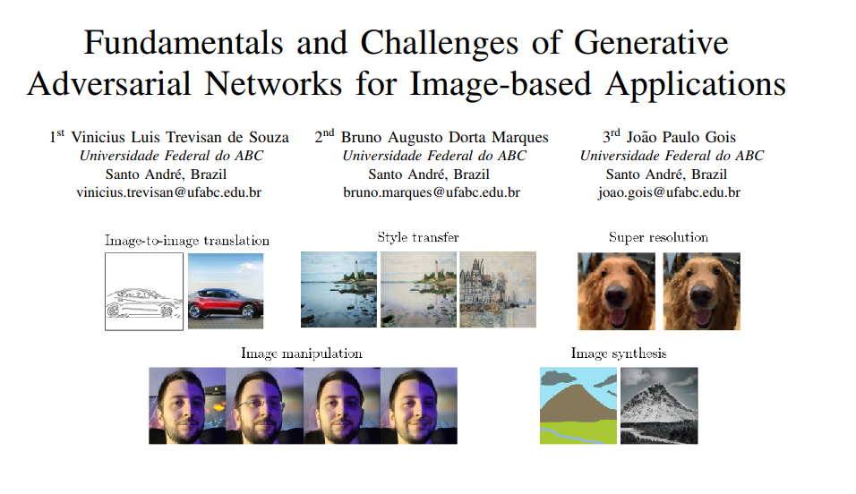

## Extra material for the SIBGRAPI 2022 Tutorial:

# Fundamentals and Challenges of Generative Adversarial Networks for Image-based Applications

Authors: Vinicius Luis Trevisan de Souza, Bruno Augusto Dorta Marques, João Paulo Gois

Centro de Matemática, Computação e Cognição

Universidade Federal do ABC

---

This repository contains the supplementary material for the [SIBGRAPI 2022](https://www.natalnet.br/sibgrapi2022/) Tutorial ***"Fundamentals and Challenges of Generative Adversarial Networks for Image-based Applications"***.

The associated paper is available on the [IEEE Xplore website](https://ieeexplore.ieee.org/abstract/document/9991776).

Feel free to use it for self-study, but full or partial reproduction is prohibited without the permission of the authors.

## Abstract

Significant advances in image-based applications have been achieved in recent years, many of which are arguably due to recent developments in Generative Adversarial Networks (GANs). Although the continuous improvement in the architectures of GAN has significantly increased the quality of synthetic images, this is not without challenges such as training stability and convergence issues, to name a few. In this work, we present the fundamentals and notable architectures of GANs, especially for image-based applications. We also discuss relevant issues such as training problems, diversity generation, and quality assessment (metrics).

